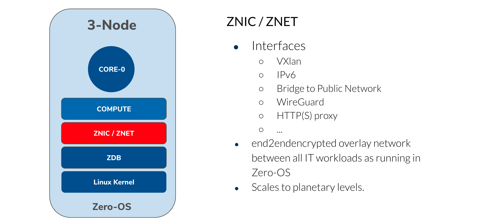

# ZNET

The ZNet's are the overlay networks connecting all the ZMachines. 

## Is a Peer2Peer network

This technology is based on wireguard and we have made it P2P and meshed so it can work from everywhere.

!!!def 

!!!include:zos_toc