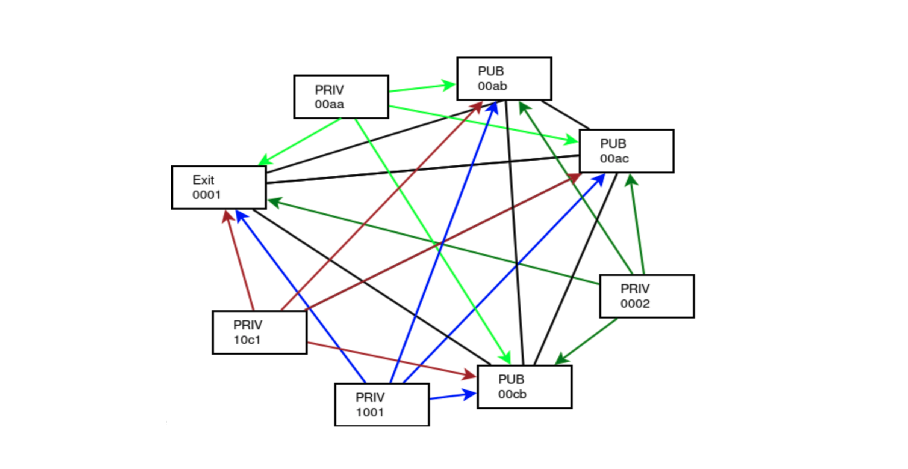

# Planetary Network

Overlay network which lives on top of the existing internet or other peer2peer networks created.
In a network, everyone is connected to everyone.
End-to-end encryption between users of an app and the app running behind the network wall.
Each user end network point = strongly authenticated & uniquely identified independent of network carrier used.
No need for centralized firewall or vpn solutions, this is circle based networking security.

Benefits :
- finds shortest possible paths between peers
- Full security through end-to-end encrypted
- allows for peer2peer links like meshed wireless
- can survive broken internet links and re-route when needed
- resolves the shortage of IPV4 addresses

!!!def alias:planet_net,planetary_net,planetary_network

!!!include:zos_toc

