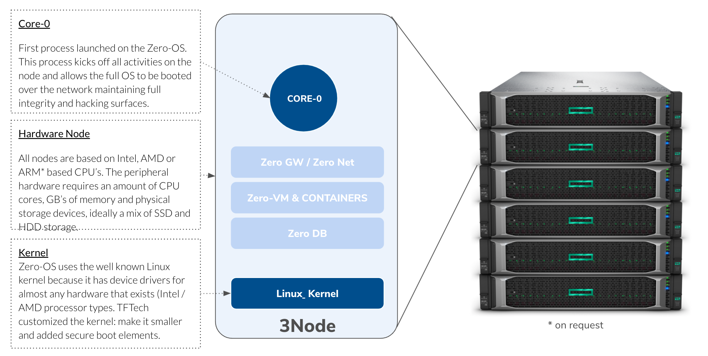

# Zero-OS

!!!include:zos_intro_text

## The requirements for our TFGrid based on Zero OS are:

- **Autonomy**: TF Grid needs to create compute, storage and networking capacity everywhere. We could not rely on a remote (or a local) maintenance of the operating system by owners or operating system administrators.
- **Simplicity**: An operating system should be simple, able to exist anywhere, for anyone, good for the planet.
- **Stateless**. In a grid (peer-to-peer) set up, the sum of the components is providing a stable basis for single elements to fail and not bring the whole system down. Therefore, it is necessary for single elements to be stateless, and the state needs to be stored within the grid.

## github

- If you are technical, you can learn more on our github repsitory: [Zero-OS](https://github.com/Threefoldtech/zos/tree/master/docs).

!!!include:zos_toc

!!!def alias:zos,zero-os,threefold_operating_system,tf_os,threefold_os
