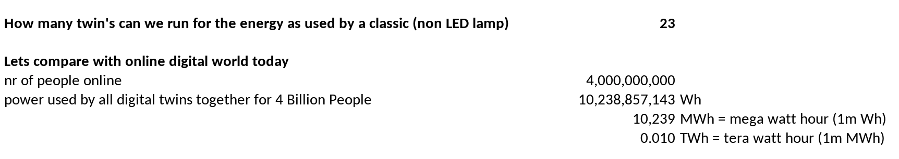

# 25 Digital Twin per Light Bulb

We can run 23 digital_twins with the energy as used by one light bulb.

## How much energy do datacenters use by 2020

This graph says the world would use 200 TWh for datacenters.

This is a conservative nr, we have seen nr's 10x higher.

## How can we compare this to a digital twin power usage.

> If the digital twin only replaces 20% of IT market, in that market it would use 4000 less power in most conservative case already today, but upto 50.000 times less in the future.

!!!include:energy_savings_toc