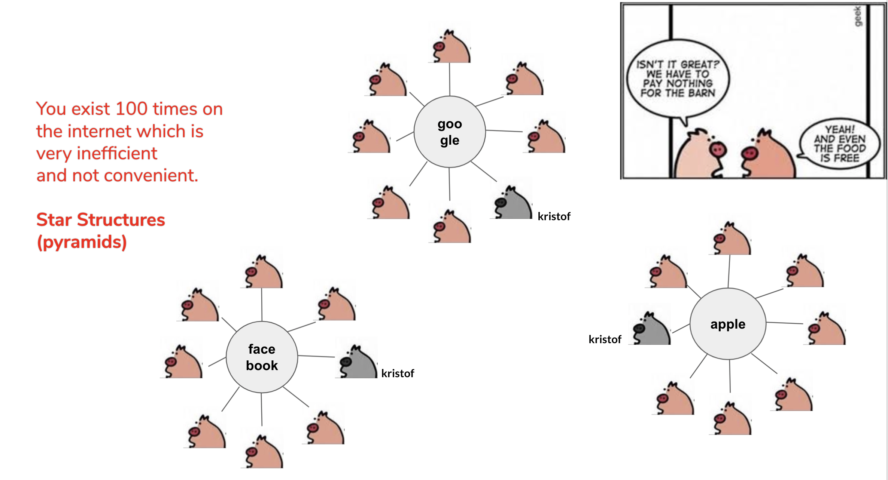
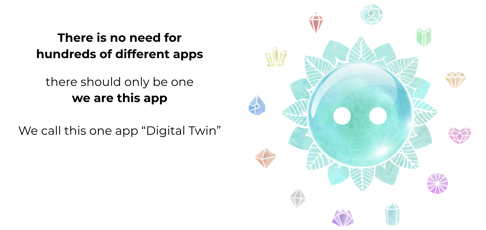
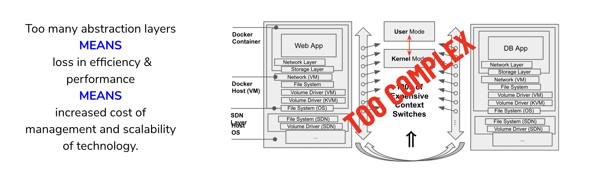

# Energy Savings Digital Twin

In this document we walk you through how much more efficient a digital twin is in relation to power utilization compared to the alternative in the world today.

## The world consumes an awful lot of energy, we just need to do better.

To power 4 Billion people with a system like ours we need less that 10 giga watt of power (see [calculation](energy_savings_digital_twin_calc)).

 > Each twin uses about 2.6 watt of power.  
 > This means we can host 23 digital twins on an electricity budget of a lamp.

 The world uses a lot of energy:

Potential power savings sum up more than 4.000 times for datacenters alone.

## How else can we save power:

- network: at least 10x less due to requiring less bandwidth
- production of IT: 10-100x
- consumer devices: probably not much
- datacenters: huge, for sure +100 times less if we consider all workloads

> **Conclusion we can for sure save between 10 and 100 times on global power requirements for our digital life, we believe this is incredible and worth it.**

[calculation see here](energy_savings_digital_twin_calc)

## Why the world is consuming so much energy:

### The high level problem

In today's digital world we exist more than 100x times and this is super inneficient. 

For each case of use (e.g. facebook, amazon, gmail, ...) we exist in a huge system with databases and compute front ends. Google for their mail and office alone has millions of servers.

### Only 1 digital twin required:

To run your digital life you only need 1 digital twin to be alive instead of 100 different client-server systems.

Each digital twin is highly efficient to process your digital life.

All these digital_twins talk to each other in a peer2peer way leading to a tremendously efficient organic system.

### why can we be so efficient compared to a centralized system:

Typically we can host more than 100 users on a small host (computer) of less than 2000 EUR.

We have to ask ourselves, how much active data are we working with on any point in time?

We believe this is not more than 100 MB of data.

Bigger files (video/audio) are streamed to the backend but you don't use them all the time and if you do they are very easy to cache e.g. a video of 1 GB takes about 1 hour to watch it.

The other content are messages, structural data, etc., this easily fits in 100 MB of memory.

This means a digital twin can keep most data in memory which you use at that time which means the twin does not need to go to the backend that much saving amazing amount of energy.

By keeping more things in memory the following advantages apply

- a lot less context switches: avoid_context_switches
- no stress on backend storage system
- no SSD access required

### upto 100x less networking required:

Today in our digital life we have to go to centralized locations for most of what we do.

If 2 people in a village in Africa send a message to each other, the message is first going to centralized datacenter e.g. in United States where it will go to another location in the world, before it goes back to the recipient who fetches it through their (web) based email client.

This is super inefficient.

- the message travels many thousands of km (instead of 2 km)
- the message needs to go over 2 centralized mail systems (sometimes over multiple hops)
- the message gets stored in large databases (2x)

This is not needed, with a digital twin the sender talks to his twin which is close to him, that twin will find the other twin to send the message directly. The twins are probably close to each other because the sender and receiver twin are in the same city. This leads to a much more efficient way how to deal with data transport.

Networking uses a lot of power in the world (see graph below), thanks to our approach we can also save a lot of energy here.

!!!include:effect_cooling

### avoiding context switches:

In client server systems, there are many software layers.
In the world today everything is a client server system.

Database layers, software defined networking, storage and network virtualization, hypervisors, process managers, ...

Each of these layers have to do lots of context switches.

Context switches are the main cause of servers not being used efficiently.

A context switch is needed when the CPU needs to switch out memory so it can process something for a specific process. Whenever another process needs time, the memory required for tht process needs to be transfered into the CPU. 

On busy servers the amount of context switching is huge, the more layers, the more context switching.

We have seen server systems which are only usable for less than 20% of their real capacity compared to pre-emptive multi tasking.

Thanks to the design of a digital twin a lot of these context switches are avoided leading to a much more efficient system.

### Usage of a fast development language:

The Digital Twin is compiled to C. C is a very fast language and allows us to be efficient in utilization of the hardware resources.

### Digital Twin Uses Our Quantum Safe Storage System:

See qsss. 

The cost for storage in our design is super low see [energy_savings_storage](energy_savings_storage).

Thanks to this design every twin can store data over multiple nodes in all security but yet under full control and saving lots of energy, see that [doc](energy_savings_storage).

### Many more tricks:

There are many more tricks and we will be able to do even more in the future.

e.g.

- pre-emptive multitasking for all actions: avoiding more context switching
- do more of the low level algorithms in e.g. FPGA cpu's
- liquid cooling

## Calculation:

see [digital twin power savings calc](energy_savings_digital_twin_calc)

!!!include:energy_savings_toc
