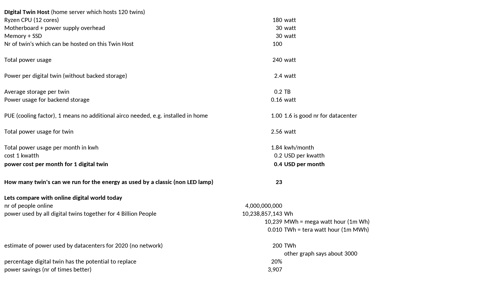

# Energy Savings Digital Twin Calculation

Note

- network energy, AI, gaming & virtual reality energy utilization are not included (not in marketdata as well as in our calc)
- we only compare with 20% of the total potential (is parameter) = we say our Twin only relevant for 20% of market. 

This shows how a digital twin can be a very power efficient way how to deliver a green digital life to everyone.

> In this calculation we save 4000 times on energy usage compared to the world today.

!!!include:energy_savings_calculator

!!!include:energy_savings_toc
