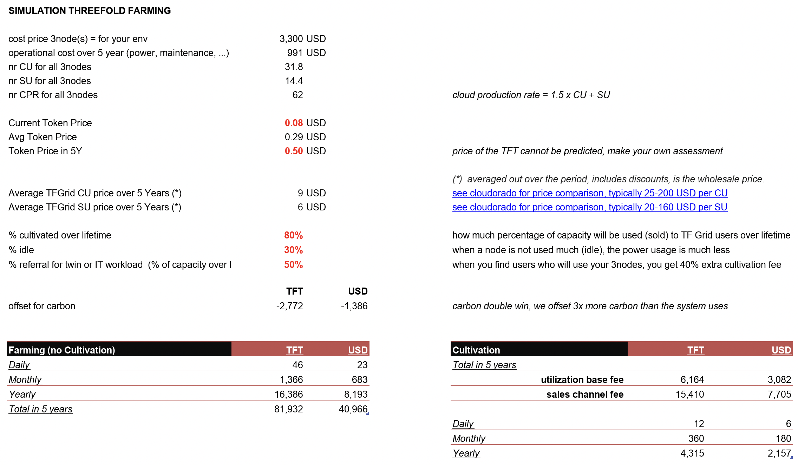

# Farming Reward Calculator

We have created a calculator to allow you to simulate your potential return on investment of becoming a Farmer. Different nodes will produce a different CPR. 

The [Farming Logic v3 document](farming_reward) describes how many TFT your node will receive as CPR_reward. 

Thanks to our sales model you also do not have to sell the capacity of your server(s), the threefold_channel takes care of this.

## Example Hardware

## Example Simulation

remarks
- Once a node is registered the CPR reward, and cultivation % are registered on the blockchain, your farming will be in line with those parameters till end of life.
- Farmed TFT gets staked (pooled) per 3Node (per server) and only unlock if +30% is used of capacity or max of 24 months.
- Minimal SLA's need to be achieved before the farming reward can be earned (uptime, bandwidth, latency, ...)
- If you delete your 3Node, the staked tokens will remain on your name and come available after 24 months since start.
- you can sell your own capacity, this will give you additional 40% cultivation rewards (so 50% total), the rest is for marketing and burning.
- These are farming logic terms for 3.0, which will be activated summer 2021
- The CPR reward is regularly revisited by the Wisdom Council to reflect price changes of the TFT, your CPR reward does not change !
- Starting Q4 2021, you can also become a network farmer, which means you can get income to allow people to use your IPV4 addresses and internet network capacity for public services

## Calculator

Do your own calculation:

- [Reward Simulator for Farming Spreadsheet](https://secure.threefold.me/sheet/#/2/sheet/view/bn9RY8qkB2QSvhNGnk+RNTqiz2YwVoZeGN+UrntDYhU/)

## Risks

- ThreeFold Technology is not working
  - _FACT: The technology is already working today_
- The ThreeFold token does not appreciate in value
  - _Unlikely: The cloud business by itself is growing and with increasing update of the TF Grid as an alternative to the large cloud vendors there will be token scarsity._
  - _The ThreeFold_Council can make changes the business model to create more scarsity (e.g. burn a higher percentage of the tokens)._
- Digital Currencies become illegal
  - _Unlikely: TFT has a utility - TFT represents  unit of compute and storage capacity._
  - _Even if this would happen despite all logic, then normal FIAT currencies can be used.  The token is only a effective means of value exchange._

## Remarks

- The calculation is only valid for Farming Version 3.
- Please read [how to use our Farming Calculator](farming_calculator_howto).

!!!include:farming_toc

!!!alias tf_farming_simulator,farming_simulation,farming_simulator,farming_calculator

!!!include:farming_reward_disclaimer