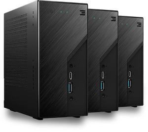

## TF Farming Hardware Overview

A 3Node connects to the ThreeFold Grid once booted by the operating system - Zero-OS. 

The form factor, size, and hardware specs can vary from very large (data center nodes) to very small (no bigger than a modern modem) ones. The hardware specifications (compute & storage) of a 3Node determines the amount of ThreeFold Tokens that the device will farm.

**You'll find below different options to start farming according to how technical you are.**

## Non-technical farming set-up

### Plug & Farm 3Nodes

**Titan V2:** The Titan 3Node is a medium sized 3Node that already comes with great hardware specifications.

Plug & farm nodes have already been installed and configured to farm for the customer. Therefore, they do not require any technical knowledge to set-up. All you need is an electricity outlet, internet connection and an app on your smartphone to start farming and receive your tokens! All 3Nodes can be hosted using normal DSL connectivity. 

You would be required to provide your own hosting but farming cooperatives provide administrative services for your farm.

In the future 3Nodes will be eligible for Certification by various providers to increase trust and potential return on investment.

You can pre-register for the next batch of Titan Nodes [here](https://threefold.io/farming/pre-register).

## Technical farming set-up

### Pre-configured Nodes

ThreeFold certified hardware designed and built by HPE – these pre-configured servers are optimized for maximum token earnings. There are different sizes in various price points available. These nodes are mainly for professional usage in data centers.

You will be required to provide your own hosting as well as set-up and administer your own farm.

If you want to purchase an HPE node for delivery in European countries visit **[4IG Node Shop](https://threefold.4ig.hu/)**.

For any other countries please contact vlaho.jemin@hpe.com.

### Do It Yourself (DIY) Nodes

Create your own 3Node by installing Zero-OS on your own standard server/hardware. This option does not provide any contractual relationship with anyone in the ThreeFold_Grid Ecosystem, but enables anyone to become a farmer. You can purchase a server/hardware from any supplier or use your existing server/hardware. It must have an Intel or AMD CPU and can have any kind of hard drives (HDD/SSD). Over time, a DIY farmer can build reputation, measured by the Grid Reputation_Engine.

It is recommended to have the following hardware configuration:

- A ratio of 1:4 between vCPU and GB memory.
- At least 1 SSD for storage.
- If you add HDDs, please check if there is enough bandwidth available to have enough performance for storage capacity usage.

You will be required to provide your own hosting as well as setup and administer your own farm.

<!-- > Note: Both the 'Pre-configured Nodes' and the 'DIY Nodes' require technical expertise to create your own farm and add your servers/ nodes to the ThreeFold_Grid. Learn more about it [here](https://sdk.threefold.io/#/farm_setup_management). -->

