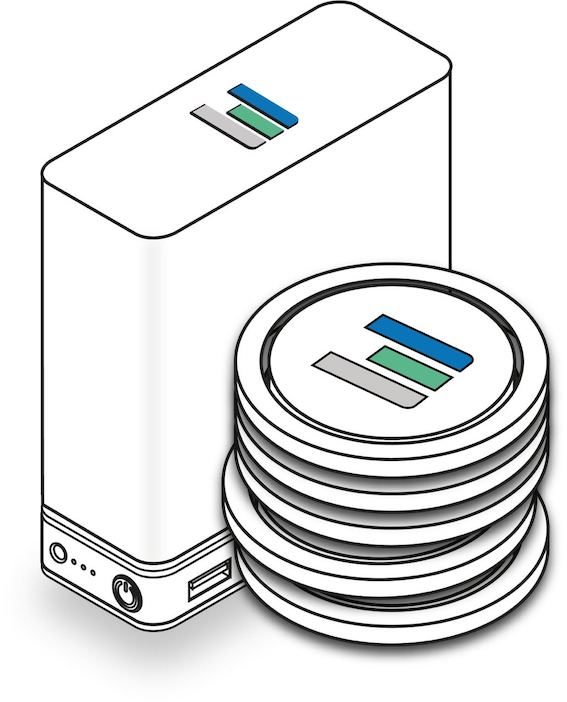

# Farming Rewards Logic (V3)

TFT is rewarded to farmers every month for connecting (storage & compute) to the ThreeFold_Grid. The amount of farmed TFTs is calculated by the open source [consensus driven token reward engine](tftech:consensus3). 

> Note: The consensus driven token reward engine hasn't been implemented yet. It will be live with ThreeFold Grid 3.0 in H2 2021. 

!!!include:farming_logic_disclaimer

## Farming Reward Logic Variables

The amount of TFTs that are created by farmers depends on three variables:
- Proof-of-Capacity
- Cloud Production Rate (CPR)
- Uptime

### 1. Proof-of-Capacity

The specs of the farmers' 3Node:

- Compute Capacity (CPU)
- Memory Capacity (RAM)
- Storage Capacity (SSD/HDD)

The proof of capacity is stored on a redundant storage system and hashed (fingerprinted). The hashes verify the authenticity of the report and are stored in the minting transactions on the blockchain. 4 days later, the TFTs are transferred to the farmer. 

The minting consensus needs to be achieved before minting can actually happen. In the transaction message, the hash will be stored on the blockchain and will represent an immutable proof of the capacity for each minting operation.

This is expressed by CPR.

!!!include:cpr

### 3. Uptime

The Consensus_Engine measures uptime and other SLA parameters. If the required minimal levels are not reached no farming rewards will be rewarded to the farmer.

> Note: The consensus driven token reward engine hasn't been implemented yet. It will be live with ThreeFold Grid 3.0 in H2 2021.

## Cultivation Fee and Burning of TFT

10% of Cultivation fee goes to farmer.

20-40% of the cultivation fee is being burned by means of the ThreeFold Chain in ThreeFold Grid 3.0. This means these tokens are destroyed. This makes sure that the amount of tokens being created are low in relation to the value increase of the grid.

If a box is used for +80% then there will be more tokens burned than farmed, which means the amount of TFT goes down leading to more scarcity.

The rest of the cultivation fee is used to reward the capacity sales channel, see threefold_channel.

Details see [farming logic 3.0 TFT flows](farming_logic3_tftflow).

> Note: The idea is to have more tokens burnt then farmed but this will depend on the global level of utilization of the ThreeFold Grid.

## Remarks

> A small amount of Farmers are still on v2.0 farming reward which is based on a difficulty level in relation to max amount of TFT. (4 Billion) see [Farming Logic 2.0](farming_logic2). 2.0 Farmers can choose to upgrade to the 3.0 Farming Model, contact ThreeFold please.

Learn more:
- How to Calculate your CPR with [3Node Production Calculator](farming_hardware_calculator).
- Compute and storage units on the [Cloud Units](cloud_units) page.
- How to calculate your [ROI on a 3Node investment](farming_calculator).
- Calculating your 3Node's CPR can be done through the [Farming Hardware Calculator](farming_hardware_calculator)

!!!include:consensus3_toc
!!!include:farming_steps
!!!include:more_info_rewards
