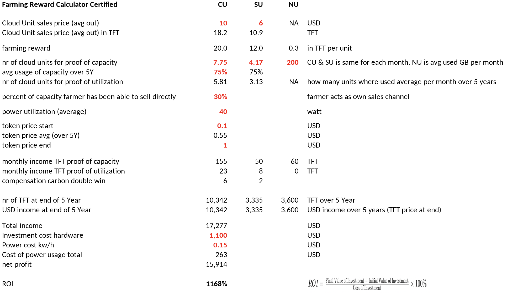
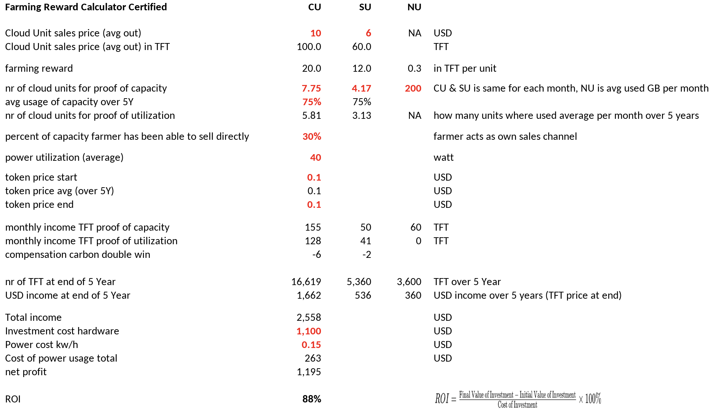

### Tital v2.1 calculation

#### Simulation 1: TFT goes to 1 USD

- TFT price goes to 1 USD
- investment cost = 1100
- 75% of capacity used by TFGrid users
- 30% sold by farmer itself

> Delivers a return of 1168%

#### Simulation 2: TFT does not go up in price.

- TFT price stays same
- investment cost = 1100
- 75% of capacity used by TFGrid users
- 30% sold by farmer itself

> Delivers a return of 88%

!!!include:simulation_note