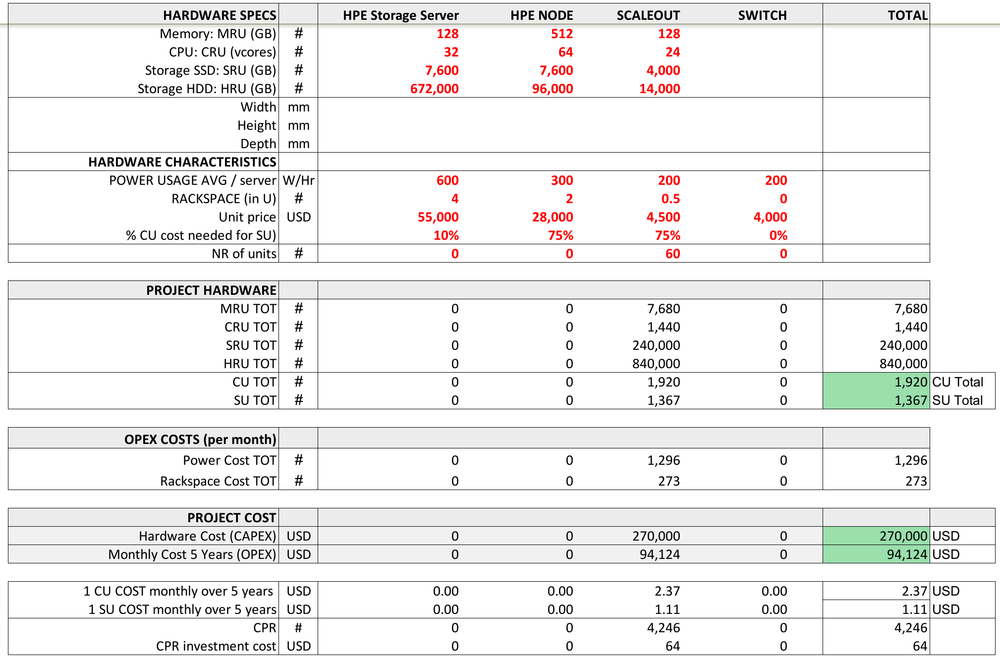

# Farming Hardware Calculator

The following calculator allows you to configure your own hardware and do a simulation for

- monthly cost
- capex cost
- nr CU/SU resulting in CPR

see [Hardware Calculator](https://secure.threefold.me/sheet/#/2/sheet/view/UyFs5dFBQWnyswB3RNMQO5Ojh-PkvBDdMTqvQs2IqpI/)

## How to work with the calculator.

Download the calculator, click on File, Export...
Best to install onlyoffice, this has been used to create this calculator.

Only change the red nr's

> DISCLAIMER: this calculator is to be used at own discretion, no promises of any kind are made by ThreeFold.  

!!!include:more_info_rewards
