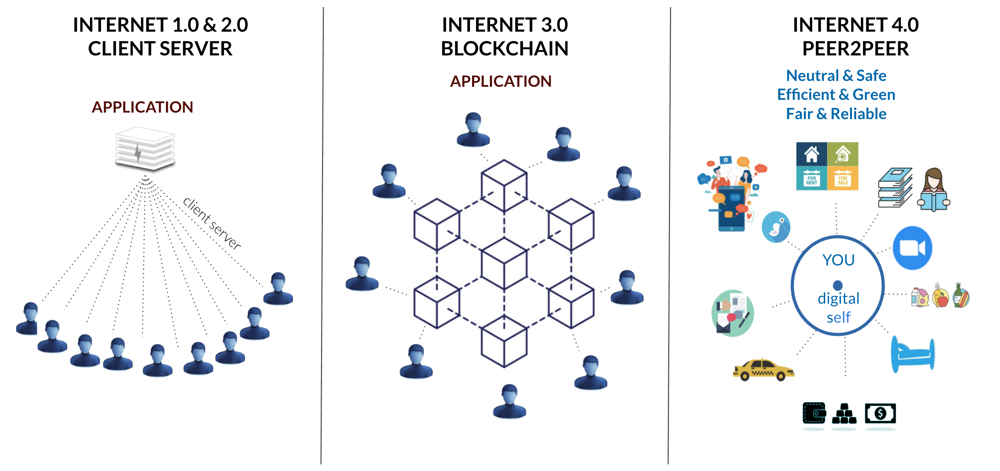

# Web2.0 vs Web3.0 vs ThreeFold Grid

Web2.0 refers to the version of the internet most of us know today. An internet dominated by companies that provide services in exchange for your personal data. 

Web3.0 refers to a decentralized architecture that runs on a blockchain. Web3.0 is a very good step forward. It is still a client server model though and has certain issues. For internet and storage workloads Blockchains tend to be slow and are hard to scale due to their consensus methods. 

> Web4.0 is a new approach which is 100% compatible with the blockchain (web3) and existing internet (web2) world.

## ThreeFold Grid Benefits

Developers and users have many reasons for choosing the ThreeFold's peer-to-peer and autonomous grid:

- No one can block you or deny you access to the service.
- Payments are built-in via the native token, the ThreeFold Token (TFT).
- ThreeFold integrated with the most widely used protocols and systems meaning you can pretty much program anything.
- Transactions and workloads can scale limitlessly as it is truly decentralized. They do not have to be processed by any intermediaries as they get propagated end-to-end throughout the network directly to the intended recipients.
- Building applications and infrastructures on the ThreeFold Grid is more affordable than on web 2.0 and web 3.0. 
- The "zero people" approach to the ThreeFold Grid enables to bring incredible security features. With it's end-to-end model between users and servers, there are no back-doors, and by not using TCP/IP, there are no incoming connections from the web2.0 Internet.
- By it's peer-to-peer nature, storing and exchanging information and value on the ThreeFold Grid requires a lot less energy than on web 2.0.  

## Centralized vs Blockchain vs Peer-to-Peer

In the table below, we list some of the major advantages and disadvantages of centralized, decentralized and peer-to-peer digital networks.

| Centralized                                                                                                                                                                                                            | Blockchain                                                                                                                                                                                                                       | Peer-to-Peer                                                                                                                                                                                    |
| ---------------------------------------------------------------------------------------------------------------------------------------------------------------------------------------------------------------------- | -------------------------------------------------------------------------------------------------------------------------------------------------------------------------------------------------------------------------------- | ----------------------------------------------------------------------------------------------------------------------------------------------------------------------------------------------- |
| Low network diameter (all participants are connected to a central authority); information propagates quickly, as propagation is handled by a central authority with lots of computational resources.                   | The furthest participants on the network may potentially be many edges away from each other. Information broadcast from one side of the network may take a long time to reach the other side.                                    | A peer-to-peer network enables any participant and node to exchange information and value end-to-end seamlessly                                                                                 |
| Usually medium performance (high throughput, normal computational resources needed) and easy to implement.                                                                                                             | Usually lower performance (lower throughput, more computational resources needed) and more complex to implement.                                                                                                                 | Higher performance (high throughput, less computational resources needed) and easy to implement                                                                                                 |
| In the event of conflicting data, resolution is clear and easy: the ultimate source of truth is the central authority.                                                                                                 | A protocol (often complex) is needed for dispute resolution, if peers make conflicting claims about the state of data which participants are meant to be synchronized on.                                                        | Every individual and organization is sovereign. They own 100% of their information and no one else has access to it.                                                                            |
| Single point of failure: malicious actors may be able to take down the network by targeting the central authority.                                                                                                     | No single point of failure: network can still function even if a large proportion of participants are attacked/taken out.                                                                                                        | No single point of failure, the system is decentralized, self-driving and self-healing, meaning the system will adapt and always display required information                                   |
| Coordination among network participants is rather easy, and is handled by a central authority. Central authority can compel network participants to adopt upgrades, protocol updates, etc., with very little friction. | Coordination is often difficult, as no single agent has the final say in network-level decisions, protocol upgrades, etc. In the worst case, network is prone to fracturing when there are disagreements about protocol changes. | Coordination is often difficult, as no single agent has the final say in network-level decisions, protocol upgrades, etc. However, the network cannot fracture due to the self-healing feature. |
| Central authority can censor data, potentially cutting off parts of the network from interacting with the rest of the network.                                                                                         | Censorship is much harder, as information has many ways to propagate across the network.                                                                                                                                         | Censorship is not possible as there is no intermediary and it is impossible to edit information of others.                                                                                      |
| Participation in the network is controlled by the central authority.                                                                                                                                                   | Anyone can participate in the network; there are no “gatekeepers.”                                                                                                                                                               | Anyone can participate in the network and it is very affordable.                                                                                                                                |

Note that these are general patterns that may not hold true in every network. Furthermore, in reality the degree to which a network is centralized/decentralized lies on a spectrum; no network is entirely centralized or entirely decentralized. Peer-to-peer networks enable participants to become the central point of their digital life and to organize the environment around them as they wish. In other words, it provides the freedom to all actors to organize in the most suitable way across the centralization/decentralization spectrum. The infrastructure however remains truly decentralized. 

> More info see [Internet 4 concept](internet4:internet4).

!!!include:grid_toc