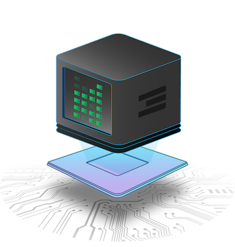

# Overview

Welcome to the ThreeFold Technology knowledge base.

In this section, you will learn about the main ThreeFold technology components, its features, why it's so important to have a new peer-to-peer Internet, and how to take part in that peer-to-peer economy.

  - [ThreeFold Layers](threefold_layers) - A brief overview of ThreeFold's technology layers
  - [Capacity Layer](capacity_layer) - A walk through the main components, concepts and features of the capacity layer.
  - [Autonomous Layer](internet4:part1_autonomous_layer_introduction) - A guide through the main components, concepts and features of the autonomous layer.
  - [Technology Components](hercules_components) - A listing of all ThreeFold Grid products sheets for tech experts and developers.