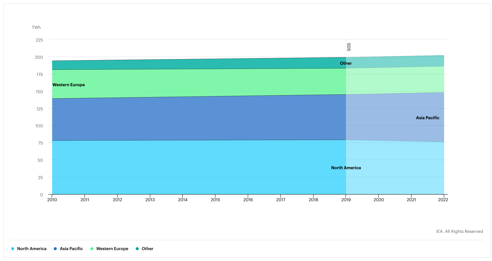

# 25 Digital Twin per Light Bulb

We can run 25 digital_twins with the energy as used by one light bulb.
<!-- 
## How much energy do datacenters use by 2020

This graph says the world uses 200 TWh for datacenters alone (no generic IT workloads, no network, ...).

## How can we compare this to a digital twin power usage.

> If the digital twin only replaces 20% of this datacenter IT market, in that market it would use  less power in its most conservative case already today. -->

!!!include:energy_savings_toc
