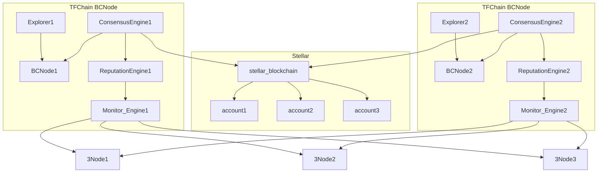

```mermaid
graph TB
    subgraph Stellar
        stellar_blockchain --> account1
        stellar_blockchain --> account2
        stellar_blockchain --> account3
        click stellar_blockchain "/threefold/#stellar_blockchain"
    end
    subgraph TFGridBCNode1[TFChain BCNode]
        Explorer1-->BCNode1
        ConsensusEngine1-->BCNode1
        ConsensusEngine1 --> stellar_blockchain
        ConsensusEngine1 --> ReputationEngine1
        ReputationEngine1 --> Monitor_Engine1
        click ReputationEngine1 "/info/threefold/#reputationengine"
        click ConsensusEngine1 "/info/threefold/#consensusengine"
        click BCNode1 "/info/threefold/#bcnode"
        click Explorer1 "/info/threefold/#tfexplorer"
    end
    subgraph TFGridBCNode2[TFChain BCNode]
        Explorer2-->BCNode2
        ConsensusEngine2-->BCNode2
        ConsensusEngine2 --> stellar_blockchain
        ConsensusEngine2 --> ReputationEngine2
        ReputationEngine2 --> Monitor_Engine2
        click ReputationEngine2 "/info/threefold/#reputationengine"
        click ConsensusEngine2 "/info/threefold/#consensusengine"
        click BCNoBCNode2de1 "/info/threefold/#bcnode"
        click Explorer2 "/info/threefold/#tfexplorer"

    end
    Monitor_Engine1 --> 3Node1
    Monitor_Engine1 --> 3Node2
    Monitor_Engine1 --> 3Node3
    Monitor_Engine2 --> 3Node1
    Monitor_Engine2 --> 3Node2
    Monitor_Engine2 --> 3Node3
    click 3Node1 "/info/threefold/#3node"
    click 3Node2 "/info/threefold/#3node"
    click 3Node3 "/info/threefold/#3node"
    click Monitor_Engine1 "/info/threefold/#monitorengine"
    click Monitor_Engine2 "/info/threefold/#monitorengine"


```

*click on the parts of the image, they will go to more info*