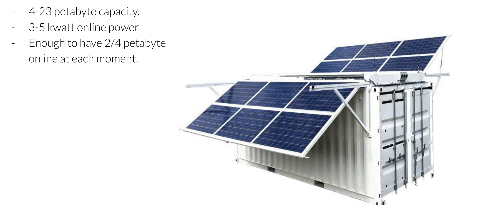

# Energy Savings Storage System

We try to make a comparison by a generic storage system based on HDD and replication.
We believe this is still the majority of storage systems in the market.

Ofcourse there will be systems working differently and also be energy efficient.
But the focus does not seem to be there for most existing sold systems.

## avoid copies

Most systems in the storage world use replication of data as main mechanism to make sure data cannot be lost. 

Our quantum safe storage algoritm has only 20% overhead in stead of 400% overhead compared to a replicated storage system in a system where we want to be able to loose any 4 nodes at the same time.

See [quantumsafe storage algo](quantumsafe_storage_algo) for how the algo works.

We believe that using our algo saves at least 3x of storage space versus other storage systems and as such energy win.

Some new blockchain projects use also a good storage code like SIA and STORJ, they both use erasure codes. Their systems are more protocol driven systems through and not private to the user.

## multi layer

Our storage system is a multi layered system.
The encoding/front end system does a lot of caching and will make sure there is enough performance even for workloads where some random read/write is required.

The backend uses slow nodes with slow energy efficient disks.

This allows for better energy optimization.

## no need to use fast disks

In our storage system we still use HD's because they are by far still the most cost effective way how to store data.
The issue with HD's is that they spin around and as such become slow and even unreliable if the read/write behaviour is too random on these disks.

HDD's are using spinning disks. Imagine 20 users (can be software users) need to write/read data from 1 large disk at the same time. Now the read/write head needs to jump all over the disk at the same time, this leads to much more power usage, slower access times and disks breaking down faster. Unfortunately current storage systems do not take this behaviour into consideration. There are many IT processes fighting for the resources of the same disk resulting in exactly this behaviour.

In most storage systems enterprise capable disks need to be chosen because otherwise they fail fast and would become super slow. These disks tend to spin faster and are smaller.

Large HD's are not usable for variable (random, faster) workloads as done in large storage clouds.

A 14 TB disk on 7200 RPM is not doable for changing data, the random access on the disk would make it too slow per GB stored as well the disk could become unreliable if used too much.

At threefold we have developed the ZDB technology which is a low level key value stor which lives close by the HD.
The ZDB will only read and write as one user on a HDD, it will not allow multiple users to read at once.

The ZDB writes and reads in optimized way from the HDD. Larger chunks of data are nicely positioned on the spinning disk. Reads are queued one after the other and read in optimized ways. 

Writes are also queued (buffered) and will only be flushed when the reads are done. Large chunks of data are written as nicely as possible.

This allows us to use larger disks which are more cost effective and also spin slower and as such use less energy.

For such a system to work you need more intelligent top layers where caching happens and its ok to loose data.

Newer error correcting codecs are needed to compensate for disks crashing or becoming unavailable.

Our estimate is that we can save about 3x in energy usage because of using these larger, slower and more green disks.

- A green disk typically consumes 50% less energy but is much slower.
- A larger disk is 2 to 3x bigger compared to a faster enterprise capable disk

## Read/Write caching

On the storage front end nodes we do aggressive caching of read and writes on SSD.
SSD don't use energy and provide a fast layer for caching.

For redundancy reasons we can put a transactionlog (WAL = write ahead log) on nearby slave front end nodes. These nodes will replay the WAL when the master front end node would be lost or experience downtime.

Because of this caching layer large blocks of data are created (thanks to ZDB technology on the front layer), these large blocks are encoded using our qs_algo . This results in large chunks being send to the backend ZDB's once required. Each ZDB will write single writer to the HDD and only when required.

This results in the ability to use the backend HD's much less and as such save energy.

## HDs and/or storage nodes are being turned off

Our Zero-OS nodes have the abilty to turn off HD's when not needed.
Thanks to the write caching layer most disks are not active.

In large storage systems more than 90% of the disks are typically turned off. 
This leads to huge power savings and also improves the lifetime of a HDD a lot. 

This is only possible because of our caching method and the qs_algo.

## nearline storage use case

We can configure our system to only write to the backend x hours per day, which means that the storage nodes at the backend can be powered off, this happens automatically.

Imagine a system which is ingesting data on continuous basis e.g. from security camera's but ony during 4 hours a day write to the backend. This saves lots of energy again.

## what about SSD.

For sure SSD is the most energy efficient way how data can be stored these days but we find it not cost effective enough yet.

!!!include:effect_cooling

## Calculation

Following calculation is done for a 100% online system (not near line) using low powered storage nodes.

We believe that this is at least 10x more power efficient compared to other storage systems, but probably much more.

## Example

Solar powered archive.

23 PB in container, 100% solar powered.

This shows how we can be 100% on green energy thanks to all above described energy saving tricks.