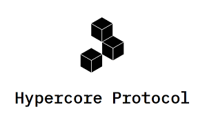

# Quantum Safe Storage System for NFT

## How

## Benefits

#### CDN support

Each file (movie, image) stored is available on many places worldwide.

Each file gets a unique url pointing to the data which can be retrieved on all locations.

Caching happens on each endpoint.

#### Self Healing & Auto Correcting Storage Interface

Any corruption e.g. [bitrot](https://en.wikipedia.org/wiki/Data_degradation) gets automatically detected and corrected.

In case of a HD crash or storage node crash the data will be "space 

#### Quantum Safe Storage

Not even a quantum computer can hack data as stored on our QSSS

#### Data 

100% control over where data is stored.

#### Green

Storage uses upto 10x less energy compared to classic replicated system.

#### Multi Interface

| interface                  |                         |
| -------------------------- | ----------------------- |
| IPFS                       |        |
| HyperDrive / HyperCore     |  |
| http(s) on top of FreeFlow |        |
| syncthing                  |   |
| filesystem                 |  |

