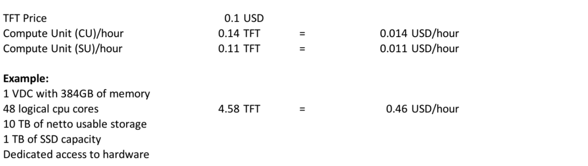

# ThreeFold 3.0 Launch

ThreeFold 3.0 is our final step in our go-to-market approach. 

We have spent the last 5 years building ThreeFold working towards this magical moment.

What is going to happen during the 3.0 launch:

- TF Grid 3.0 = Public Launch
	- farming of capacity for the Cloud 3.0 as well as Digital Twin 
	- smartest ever billing & capacity tracking system for IT capacity
		- 100% Peer2Peer, no centralization, workload definitions are private
		- ultra flexibility for anyone using & selling IT capacity = smart combination of Parity & Stellar
		- smart contract for IT using Parity Blockchain
	- **launching marketcap < 20 million USD**
    	- vesting of +75% of all tokens (see [token_overview](token_overview))
- TF Cloud 3.0 = Public Launch
	- **Edge Virtual Datacenter**, run your Kubernetes workloads anywhere in the world on the ThreeFold_Grid, compatible with all tools and full Docker/Kubernetes/... ecosystem. Compatible with major frameworks like Ansible & Helm.
	- **Quantum Safe Filesystem**: store petabytes of data at incredible cost & reliability, compatible with IPFS & HyperCore / Hyper Drive for P2P usecases. Any Storage app can be put on top. This is the most reliable and global scalable **filesystem** ever invented.
- TF Marketplace 3.0
	- marketplace of 30+ existing solutions running on top of our grid, some huge like Owncloud who will push as well, see https://marketplace.threefold.io
- TF Digital Twin 1.0 Launch
	- the first credible sovereign own your data digital avatar in the world
	- will have **dropbox, whatsapp, office, zoom alternative** inside.
	- will have multicurrency digital currency wallet + trading bot
	- **digital twin for life** program = first 100k users can buy the Twin for life time usage for only 100 USD, will be a token by itself. Price will go up 10 USD per 100k, Max 1m users can ever have this.
- **ACI** = Alliance for Conscious Internet = incredible partners will launch with us and make publicity
	- Solidaridad will sell & promote "yellow" farming boxes
	- Spinn: Coffee Token + Digital Twin Hosted on Coffee Machine in every household !!!
	- quite some blockchain parters, Digibyte is one of them
	- ... to be completed ... 
- **Education & Positive Climate Change Program**
	- purpose: lower carbon output with 10% on a global scale
	- give students access to internet & education tools
	- partnership with with TAG (2.5m users, 4000 teachers) & Solidaridad & ...
	- want to raise +20m USD to enable +20m users with access to education and as purpose **to educate how to deal differently with climate**
	- carbon credits will be used as economic incentive

> every feature mentioned above can be demonstrated today 

## Communication & Promotion

- we are hiring a top notch marketing agency for global launch
- we are working with top & reputable marketmakers over multiple (de)centralized exchanges

## The TFT is valuable

- The Use Cases 
	- cloud = a blue ocean (means +- unlimited demand)
	- digital twin, unlimited growth & possibilities
	- education platform to slow climate change
- We are not talk
	- all technology pieces are there and can be tested
	- we just lack adequate funding to make this global and huge
- Valuable
	- The value of the P2P global cloud we are building = many Billions
	- The value of our joint digital lives is unlimited: Trillions
- Tokenomics
	- Max nr of TFT tokens = 4 Billion.
	- The TFT is the exclusive medium to buy/sell required IT capacity for these use cases
	- The TFT marketcap will be <20m USD at launch, so clearly lots of room for growth
- Ecosystem
	- We have great partners and together we are building this internet & ecosystem around digital twin

The TFGrid is the largest decentralised edge cloud in the world. There are 14,000 CPU cores and 80,000,000 GB storage available to be purchased on the TFGrid at this point. 

Once there are not enough TFT available (by design) the price of TFT should rise because each TFT represents future IT capacity and the internet represents a market of unlimited size ('blue ocean market').

## Pricing of our P2P cloud is crazy

Today on the Grid TFTs buy you following IT capacity:

- A CU = 4 GB memory + 2 Virtual CPU compute capacity
- A SU = 1TB net usable storage (archive)

[The prices for capacity on the ThreeFold Grid are extremely competitive, see here](cloud:tfgrid_pricing)

!!!def name:'threefold30' alias:threefold_3_0