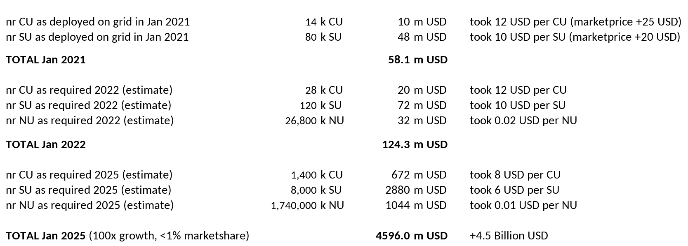

## Rough Estimate/Simulation of Future Value of TFGrid 

This shows how the value of the grid will grow in relation to the number of nodes installed.

The grid would be valued 4.5 Billion USD in this simulation, based on valuation is 5x revenue.
This is less than 1% marketshare of the cloud market at that point.

The ThreeFold_Grid is usable for much more than just cloud.

> DISCLAIMER: we do not predict nor guarantee any valuation of the future TFGrid

!!!alias grid_valuation_5y