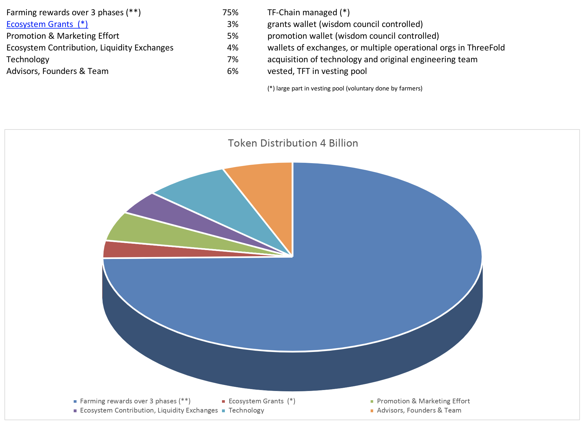
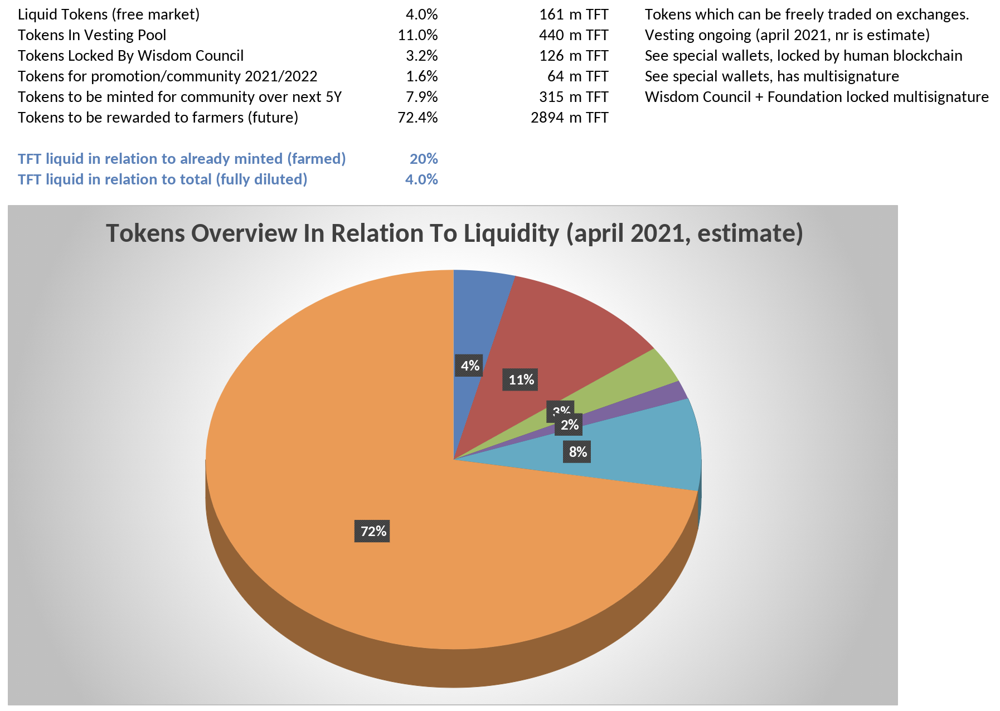

# ThreeFold Token Overview

## TFT
**Total**:
!!!tokens type:value id:total-tokens

**Accounts:**
!!!tokens type:value id:total-accounts

**Maximum Tokens:** 4 Billion

## Tokens distribution

!!!tokens type:distribution

Total locked tokens: 
!!!tokens type:value id:total-locked-tokens

Total vested tokens: 
!!!tokens type:value id:total-vested-tokens

Total liquid foundation tokens: 
!!!tokens type:value id:total-liquid-foundation-tokens

Total illiquid foundation tokens: 
!!!tokens type:value id:total-illiquid-foundation-tokens

Total liquid tokens: 
!!!tokens type:value id:total-liquid-tokens

## Locked tokens
!!!tokens type:locked-table

## Locked tokens (chart)
!!!tokens type:locked-chart

### Account (GDRFR3QGMRO5PG3BMSTFGBMDFXNVAB6HUZZS34S7QODXXFZX7YBNUQOE)
!!!tokens type:account-info id:GDRFR3QGMRO5PG3BMSTFGBMDFXNVAB6HUZZS34S7QODXXFZX7YBNUQOE

### Vesting Accounts
!!!tokens type:account-vesting id:GDRFR3QGMRO5PG3BMSTFGBMDFXNVAB6HUZZS34S7QODXXFZX7YBNUQOE

### Locked Amounts
!!!tokens type:account-locked id:GDRFR3QGMRO5PG3BMSTFGBMDFXNVAB6HUZZS34S7QODXXFZX7YBNUQOE

> Max: amount of tokens = 4 billion.

- 75% reserved for farming
  - Tokens are created as result of [Farming Rewards](tf_farming).
    - Zero-OS measured capacity
    - Which needs to be online
    - Better than required SLA (Service Level Agreement).
  - Rewarded by means of code and verified by TF_Chain (\*)
  - Rules as defined by Threefold Foundation but approved by Wisdom_Council
  - Rules are different for certified or DIY capacity
- 3% for the funding of community driven contribution projects (max 160 million of TFT)
  - Sponsor projects to the benefit of the ThreeFold Companies
  - Education, Digital twin, ...
  - None of these tokens have entered the market yet.
  - Planning H2 2021 for a maximum of 25 million TFT. See TGP.
  - First 20 million TFT, will not be sold below $0.1 and only through market maker.
  - Grants needs approval from Wisdom_Council.
- 5% for community & promotion effort
  - This will be used very wisely to promote the growth of the grid.
  - Budget needs approval from Wisdom_Council.
  - Large majority part of vesting pool.
- 4% for liquidity pool & ecosystem contributions
  - Tokens needed to grow on the exchange.
  - Tokens needed for ecosystem to let the tokens increase in value.
  - budget needs approval from Wisdom_Council.
- 7% for Technology Acquisition + Starting Team (40 people)
  - Original ThreeFold Cloud product (opensource)
  - Team who was working on this cloud project
- 6% for contributors, founders & team
  - Part of vesting pool
  - Distribution needs approval from Wisdom_Council

> Overview made on april 2021 and in preparation of ThreeFold 3.0 Launch.

<!-- Online tool see: https://tokenstats.threefoldtoken.com/ -->

## Tokens Already Rewarded (Minted)

> This shows less than 4% will be liquid at [ThreeFold 3.0 Launch](threefold30).

> WE ARE STILL IN PROCESS TO VEST TOKENS (APRIL 2021)
> See [this spreadsheet for most up to date info](https://secure.threefold.me/sheet/#/2/sheet/view/4CGJ+yMwEMhDs+66I1rxBJmYETB4j8XDcUqTJ7zOmJk/embed/).

## MarketCap

Liquid marketcap in line to token price (april 6 2021 estimate)

| TFT price in USD | marketcap  | description                     |
| ---------------- | ---------- | ------------------------------- |
| 0.06 USD         | 9.7 m USD  | discounted price, low liquidity |
| 0.08 USD         | 12.9 m USD | price april 6 2021              |
| 0.1 USD          | 16.1 m USD | base price of TFT               |
| 0.2 USD          | 32.2 m USD | 250% growth compared with today |

## TF Grid is Valuable

- [TFGrid is valuable.](token_grid_value_april2021)

## Remarks

- [link to the source sheet of the token overview](https://secure.threefold.me/sheet/#/2/sheet/view/4CGJ+yMwEMhDs+66I1rxBJmYETB4j8XDcUqTJ7zOmJk/embed/)
- We are working on a new reporting tool for TFT which takes the information from the Threefold_Grid explorer. This will be available before end of March 2021.
- [see how tokens will be farmed in future](tokens_to_farm)
- [ThreeFold Token & Grid History](threefold_history)
- [overview of the Foundation wallets](threefold_foundation_wallets)

## Disclaimer

!!!include:legal:tft_not_investment

!!!alias token_distribution,token_overview
