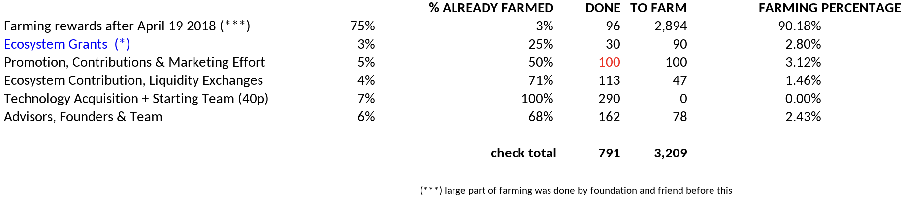

# ThreeFold Tokens To Farm

- The column `farming percentage` explains percentage which needs to go to which pool from farming.
    - This means 9.88% of farmed tokens need to go to wallets managed by wisdom_council or TF_foundation to come to the distribution as suggested.
- Only the tokens for Technology Acquisition have been fully farmed.
