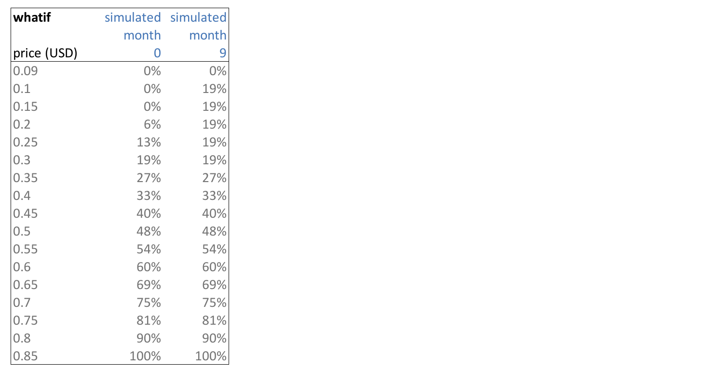

...

# Vesting Pool

ThreeFold has implemented a vesting pool over 48 months.

Most of the farming done before March 2021 has been put into this vesting pool.

## ThreeFold Vesting 

Every month, 1/48 of the tokens unlock. But once the price goes above a certain amount, more tokens unlock. See table below.

| description                          |          |
| ------------------------------------ | -------- |
| Number of TFT unlock per month       | 1/48     |
| Start unlock from                    | 0.1 USD  |
| Start accelerated unlock from        | 0.15 USD |
| Full unlock from (100% acceleration) | 0.85 USD |

Vesting starts May 2021 (Month 1)

> *TFT price used to release the vested tokens is calculated by the pricing oracle. The pricing orcale uses the average price over the last month as pulled from multiple decentralized exchanges who have a public api to do so. We* **DO NOT** *use the price as shown on one single exchange or other pricing venues such as: Coingecko, Coinmarketcap, etc.*

## Accelerated Vesting Table

The percentage is the amount of tokens which will be unlocked at that month and price level indicated. Column one is for month 0, column 2 for month 9.

In [this spreadsheet](https://secure.threefold.me/sheet/#/2/sheet/view/1n-dKvn0uImvw9y72Wai1eXhVtKLP5-gRnNT4ZmO3dQ/) you can simulate different vesting scenarios.

!!!def alias:accelerated_vesting_pool,vesting_pool

!!!include:vesting_toc